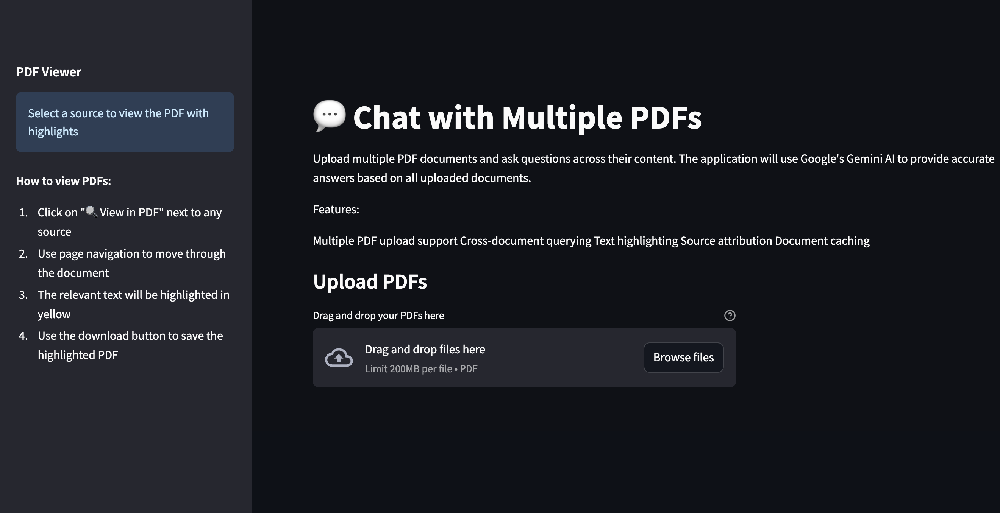
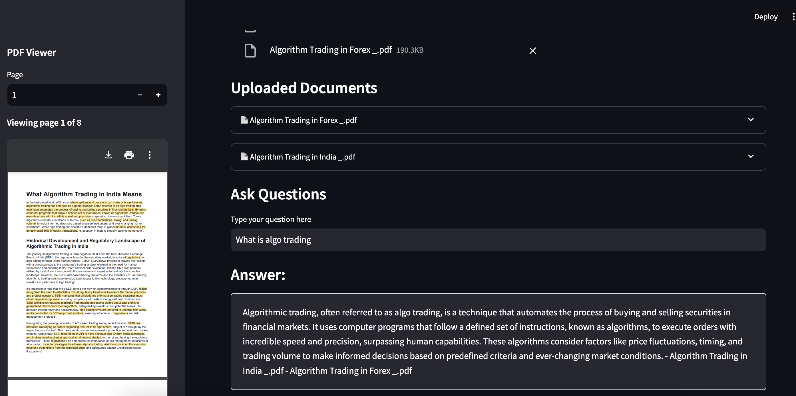
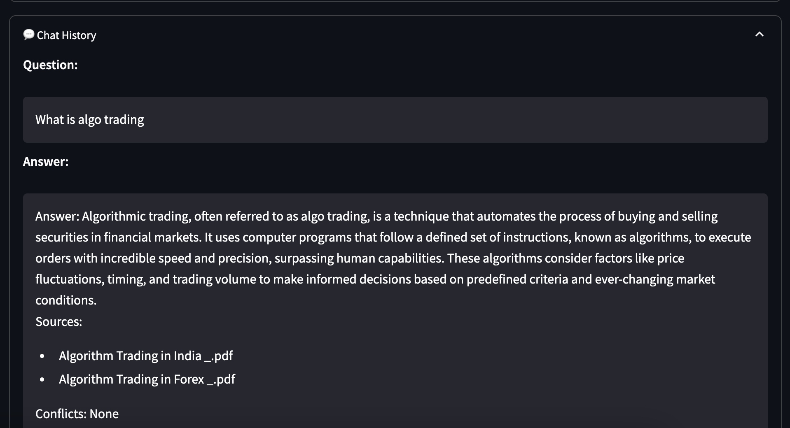

# Chat with PDF Application

This application uses Google's Gemini AI model to allow users to upload PDF documents and ask questions about their content. The software employs powerful text processing and embedding techniques to offer precise, context-aware responses.



## Features

- PDF document upload and text extraction using PyPDF2
- Efficient text chunking and processing
- Text to embedding conversion using Google's Embedding API
- Interactive Q&A with the document using Gemini-1.5-Flash
- Clean and intuitive Streamlit interface
- Source attribution for answers
- Chat history tracking







## Technical Stack

- **Frontend**: Streamlit
- **PDF Processing**: PyPDF2
- **Text Processing**: LangChain's RecursiveCharacterTextSplitter
- **Embeddings**: Google Generative AI Embeddings
- **Vector Store**: Chroma DB
- **LLM**: Google's Gemini-1.5-Flash
- **Framework**: LangChain

## Setup Instructions

1. Clone this repository
2. Install the required dependencies:
   ```bash
   pip install -r requirements.txt
   ```
3. Create a `.env` file in the root directory and add your Google API key:
   ```
   GOOGLE_API_KEY=your_api_key_here
   ```
   You can obtain a Google API key from the [Google AI Studio](https://aistudio.google.com/apikey).

4. Run the application:
   ```bash
   streamlit run app.py
   ```

## Usage

1. Launch the application using the command above
2. Upload a PDF document using the file uploader
3. Wait for the document to be processed (the text will be extracted and converted to embeddings)
4. Type your questions in the text input field
5. Get AI-generated answers based on the document's content
6. View source passages that were used to generate the answer
7. Review chat history of all Q&A interactions

## How It Works

1. **Document Processing**:
   - PDF is converted to text
   - Text is split into manageable chunks
   - Chunks are converted to embeddings

2. **Question Answering**:
   - User question is processed
   - Most relevant chunks are retrieved using embedding similarity
   - Gemini AI generates an answer using the relevant chunks
   - Sources are displayed for transparency
